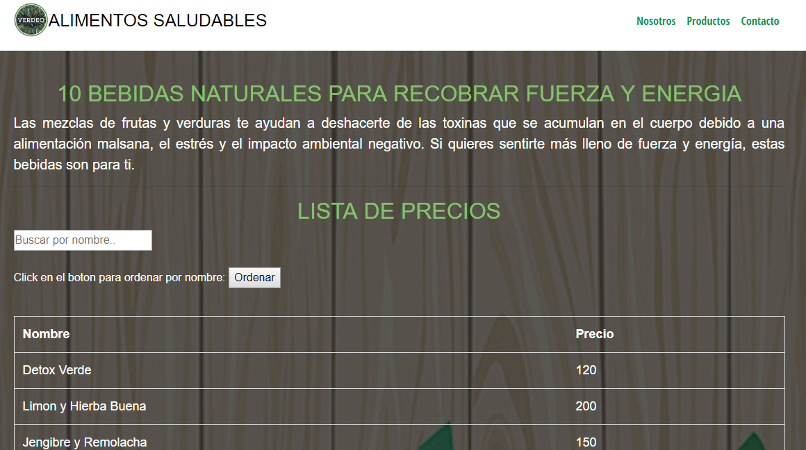
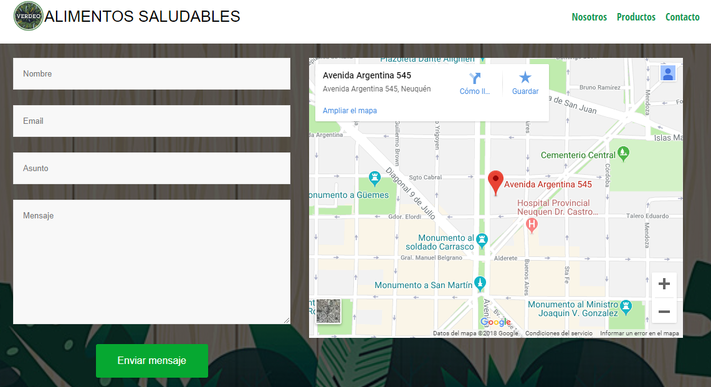
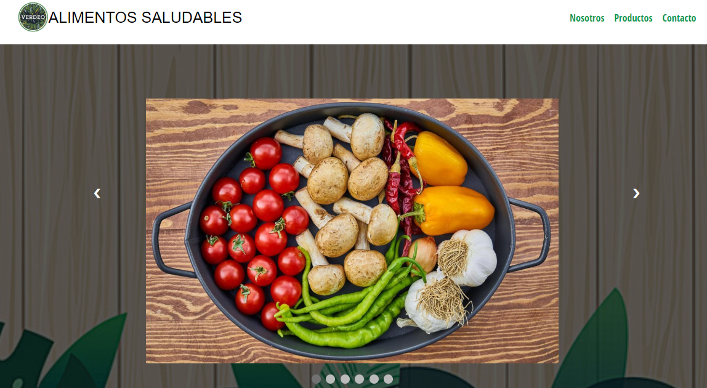

# Verdeo Sitio WEB SALUDABLE

Descripción
===========
### Proyecto academico de un sitio web para una empresa ficticia de alimentación saludable llamada Verdeo, el mismo cuenta con:

**•	Menú horizontal o vertical.**
**•	Submenús desplegables.**
**•	Enlaces a otras páginas. URL absolutos y relativos**
**•	Uso de imágenes**
**•	Visor de fotos**
**•	Tabla, con funciones de ordenamiento y filtro**
**•	Uso de algún formulario**
**•	Animación**

### Esta realizado con **HTML5**, **CSS3**, **JQUERY**, **JAVASCRIPT** y **BOOTSTRAP**. 

#### Se dejan imagenes ilustrativas del proyecto.

